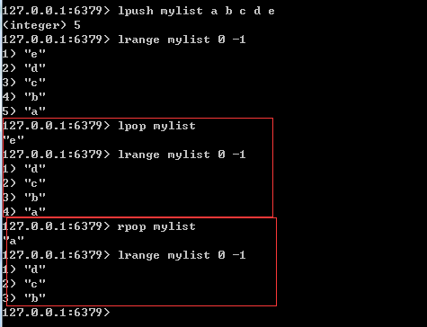

####一.redis 是内存型缓存数据库，属于nosql  
####二.redis 官网默认只提供linux 版本，window版本可以通过微软github上下载 
	  windows版链接：https://github.com/microsoftarchive/redis/releases  

####三.windows 版本redis 常用命令  
window 版redis 解压即用，截图如下：
 
    

	1.直接命名行进入redis解压目录: 
	启动redis：
	redis-server.exe redis.windows.conf
  
	2.添加到window系统服务中，然后启动
	安装服务，添加到window的系统服务中，使其开机自启动：
	redis-server --service-install redis.windows.conf   

	卸载服务，从window系统服务中移除：
	redis-server --service-uninstall 

	启动服务： 
	redis-server --service-start 
	
	停止服务： 
	redis-server --service-stop    

	3.命令行客户端 
	双击redis-cli.exe 可以进入redis命令行客户端    

####四.redis可存储的五种数据类型 
  
	String		字符串
	Hash		哈希
	List		字符串列表 （类似java中的LinkedList）
	Set			字符串集合
	SoredSet	有序字符串集合 （类似java中的TreeSet）

####五.redis 命令行下五种数据类型的存、取、删除 
> **1.String 类型**  

	存：set key value 
	例：set name zhangsan  

	取：get key  
	例： get name      

	删除：del key 
	例：del user

	如果没有key,则返回nil,java代码中实现为null 
       

> **2.List 类型  元素允许重复**  
> 特点：list的存放顺序是根据元素放入的顺序，而不是元素本身的顺序 

	Redis列表是简单的字符串列表，按照插入顺序排序。  
	你可以添加一个元素到列表的头部（左边）或者尾部（右边） 

	从左边添加：lpush key value1 value2 ... 
	例：lpush mylist a b c d e   

	从右边添加：rpush key vaule1 value2 ...
	例如：rpush list 0 -1 -2
	
	范围取：lrange key startIndex endIndex  
	特别：lrange key 0 -1 表示取全部
	例：lrange mylist 0 1
	
	指定索引取：lindex key index  
	例：lindex mylist 3  

  
  
  
   

	从头部弹出：lpop key  
	例：lpop mylist 
	
	从尾部弹出：rpop key 
	例如：rpop mylist    
     

> **3.Hash 类型**    

	存：hset key name value 
	例：hset myhash user wangwu 

	取指定key指定键：hget key name 
	例：hget myhash user 

	取指定key的所有键值：hgetall key 
	例：hgetall myhash 

	删除指定key指定键：hdel key name 
	例：hdel myhash age
    

> **4.Set 类型 元素不允许重复**  

	存：sadd key value1 value2.... 
	例：sadd myset a b c d e 

	取所有：smembers key 
	例：smembers myset 

	删除指定key中指定元素：srem key name 
	例：srem myset e
    
  
> **5.SoredSet 类型 有序集合，不允许重复**  
> 特点：zset 的顺序是指存放元素本身的顺序，一般是根据每个元素的score来排序的，  
	 而不是元素的存放顺序
  
	存：zadd key score1 value1 score2 value2....
	例：zadd mysort 1 zhangsan 2 lisi 3 wangwu 
	
	范围取：zrange key startIndex endIndex 
	特别：zrange key 0 -1 表示取全部 
	例：zrange mysort 0 3 
	   zrange mysort 0 -1   

	删除：zrange key value  
	例如：zrange mysort wangwu
      

	
####六.redis 其他命令  
	 1.自增1： incr key  
	   例如： incr num  
	
	 2.自减1：decr key 
	   例如： decr num  
  	  

	 3.自增步数：incrby key step
	   例如：	incrby num 5  
	 4.自减步数：decrby key step
	   例如:		decrby num 5
     
	
	 5.查看所有键：keys * 
	   例如：keys *  
	
	 6.判断key是否存在,1代表存在，0代表不存在  exists key	 
	   例如：exists mylist  
	
	 7.删除指定key : del key  
	   例如：del user  
	
	 8.判断key的类型： type key 
	   例如：type num   
       

####七.redis 的持久化  
	redis.windows.conf配置文件中可配置
  
	1.有RDB 的默认持久化机制
	  可配置备份策略，会生成dump.rdb文件备份redis里的数据     
	2.AOF 持久化 
	  可配置，类似于mysql的备份，可以记录每次操作的命令     
      若开启，会生成appendonly.aof 文件     

####八.redis的缓存雪崩、缓存穿透、缓存击穿

	1.缓存雪崩场景： 
		缓存机器意外发生了全盘宕机。缓存挂了，此时 1 秒 5000 个请求全部落数据库，
		数据库必然扛不住，它会报一下警，然后就挂了。此时，如果没有采用什么特别的方案来处理这个故障，
		DBA 很着急，重启数据库，但是数据库立马又被新的流量给打死了   
	
	解决办法：
	    事前：redis 高可用，主从+哨兵，redis cluster，避免全盘崩溃。
	    事中：本地 ehcache 缓存 + hystrix 限流&降级，避免 MySQL 被打死。
	    事后：redis 持久化，一旦重启，自动从磁盘上加载数据，快速恢复缓存数据。

	2.缓存穿透场景： 
		比如一个接口是根据话题id查询话题的点赞数，先从redis中查找，如果查不到就去查db;   
		一般来说话题id都是表的主键，正常用户操作如果第一次redis中没有查找到，db中肯定能查到，  
		从db中查询到了之后再设置到redis中去。但是黑客给你传了一个负数或者其他值，这个值在redis中和db中都没有。  
		那么请求就会直接打到db上，高并发的情况下，没有做任何处理，db肯定扛不住。这时redis那层没有起作用，
	    直接作用到db上，就叫缓存穿透。 
  
	解决办法：
		当redis和db中都没有查询到的话，可以将对应的id在redis中设置一个特定值，比如-1，然后再设置个缓存时间，  
		当再次访问的时候先判断是否为特定值，如果是直接返回，不走db;也可以用布隆过滤器

	3.缓存击穿场景：
		比如一个热点接口数据，先从redis中获取数据， redis中没有再查db; 由于是热点数据，并且设置了过期时间，
		可能在key失效的一瞬间，高并发的请求直接打到数据库，给数据库打死，这个就叫做缓存击穿。 
	  
	解决办法：可以设置热点key永不过期  

	
	
   
	

	

