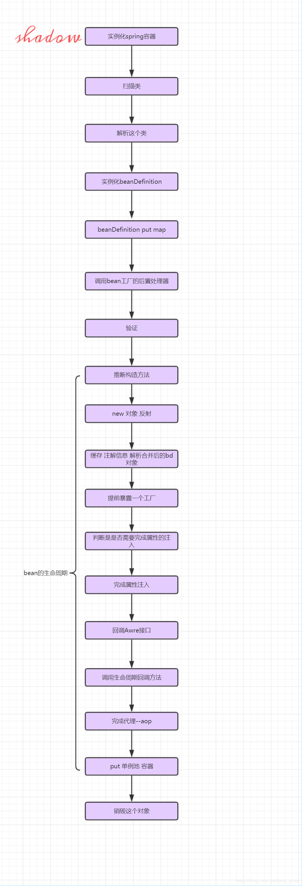

<a href="#part1"/>
**1.Spring Bean的生命周期**   

<a href="#part2"/>
**2.BeanFactoryPostProcessor** 

<a href="#part3"/>
**3.BeanPostProcessor**   

<a href="#part4"/> 
**4.Spring中的各种Aware** 

<a href="#part5"/>
**5.HttpServletRequestWrapper包装request对象**

<a href="#part6"/>
**6.RequestBodyAdvice拦截Request**  

<a href="#part7"/>
**7.ResponseBodyAdvice拦截Response** 

<a href="#part8"/> 
**8.WebMvcConfigurer配置拦截器和跨域请求等**  

<a href="#part9"/> 
**9.@ControllerAdvice和@ExceptionHandler 实现全局异常处理**   
    
<a href="#part10"/>
**10.监听器Listener**

<a href="#part11"/> 
**11.过滤器Filter**  

<a href="#part12"/>
**12.拦截器HandlerInterceptor**   

<a href="#part13"> 
**13.Spring bean 的加载规则**


<a id="part1"/>
####一.Spring Bean的生命周期     

B站鲁班学院-学习视频：[https://www.bilibili.com/video/BV1fJ411J7x4?p=1](https://www.bilibili.com/video/BV1fJ411J7x4?p=1)

  

<a id="part2"/>  
####二.BeanFactoryPostProcessor Bean工厂后置处理器   

- bean工厂的bean属性处理容器，说通俗一些就是可以管理我们的bean工厂内所有的beandefinition（未实例化）数据，可以随心所欲的修改属性   

<a id="part3"/>  
####三.BeanPostProcessor   

```java

	@Component
	public class MyBeanPostProcessor implements BeanPostProcessor, InitializingBean {
	    /**
	     * 注意：
	     * 1.在对象实例化构造方法执行之后执行，在初始化方法执行之前执行
	     *
	     * 初始化方法包括：
		 * 1.@PostConstruct方法
	     * 2.实现InitializingBean接口后，重写的afterPropertiesSet方法
	     * 3.xml 中配置的init-method 方法
	     */
	    @Override
	    public Object postProcessBeforeInitialization(Object bean, String beanName) throws BeansException {
	        System.out.println("postProcessBeforeInitialization");
	        return null;
	    }
	
	    /**
	     * 注意：
	     * 1.在对象实例化构造方法执行之后执行，在初始化方法执行之前执行
	     *
	     * 初始化方法包括：
		 * 1.@PostConstruct方法
	     * 2.实现InitializingBean接口后，重写的afterPropertiesSet方法
	     * 3.xml 中配置的init-method 方法
	     */
	    @Override
	    public Object postProcessAfterInitialization(Object bean, String beanName) throws BeansException {
	        System.out.println("postProcessAfterInitialization");
	        return null;
	    }
	
	    @Override
	    public void afterPropertiesSet() throws Exception {
	        System.out.println("afterPropertiesSet");
	    }
	}

``` 

>1.Spring提供初始化回调方法(Initializing Callback)有下面三种
	
	1.@PostConstruct方法
	2.实现InitializingBean接口后，重写的afterPropertiesSet方法
	3.xml中配置的init-method方法

>且当三个同时存在时，执行顺序为

@PostConstruct----->afterPropertiesSet----->xml中配置的init-method方法  

>2.Spring Bean 提供的销毁方法有：  

   1.@PreDestroy方法 
   2.实现DisposableBean接口后，重写的destroy方法 
   3.xml中配置的destroy-method方法

>且当三个同时存在容器销毁时，执行顺序为

@PreDestroy----->destroy----->xml中配置的destroy-method方法  

<a id="part4"/>
####四.Spring中的各种Aware    

参考博客：[https://cloud.tencent.com/developer/article/1562066](https://cloud.tencent.com/developer/article/1562066)

>1.简介

	Spring框架中提供了许多实现了Aware接口的类，这些类主要是为了辅助Spring访问容器中的数据， 
	比如BeanNameAware，这个类能够在Spring容器加载的过程中将Bean的名字（id）赋值给变量。

>2.常用的Aware

- BeanNameAware：能够获取bean的名称，即是id
- BeanFactoryAware：获取BeanFactory实例
- ApplicationContextAware：获取ApplicationContext
- MessageSourceAware：获取MessageSource
- ResourceLoaderAware：获取ResourceLoader
- EnvironmentAware：获取Environment  

<a id="part5"/>
####五.继承HttpServletRequestWrapper包装request对象   

	使用场景：
	比如在过滤器中我们登录成功获取到了用户信息，可以自定义一个类继承HttpServletRequestWrapper 
	添加一个remoteUser属性，并提供get方法，然后通过过滤器包装一下，再放行；那么之后在controller
	中就可以直接通过request.getRemoteUser（）方法获取用户信息。  

>1.自定义类AuthHttpServletRequestWrapper继承HttpServletRequestWrapper类 

```java

	public class AuthHttpServletRequestWrapper extends HttpServletRequestWrapper {
	    private String remoteUser;
	    public AuthHttpServletRequestWrapper(HttpServletRequest request, String remoteUser) {
	        super(request);
	        this.remoteUser = remoteUser;
	    }
	    @Override
	    public String getRemoteUser() {
	        return remoteUser;
	    }
	}

```

>2.过滤器中使用　　

```java

		//登录成功，包装request设置登陆信息
        filterChain.doFilter(new AuthHttpServletRequestWrapper(request, session),response);
```

<a id="part6"/>
####六.实现RequestBodyAdvice接口拦截Request  

	在实际项目中 , 往往需要对请求参数做一些统一的操作,例如参数的过滤,字符的编码,
	第三方的解密等等,通常配合ResponseBodyAdvice使用  

>1 使用：自定义DecryptRequestBodyAdvice继承RequestBodyAdvice


例：

```java 

	自定义解密注解类@Decrypt
	@Target(ElementType.METHOD)
	@Retention(RetentionPolicy.RUNTIME)
	public @interface Decrypt {
	    // do nothing , just decrypt mark
	}

========================

	 /**
	 * aop根据自定义注解，解密请求参数
	 * 也可以直接继承Spring的默认实现类 RequestBodyAdviceAdapter
	 * author:lqs
	 * data:2019/12/3
	 */
	@Slf4j
	@ControllerAdvice(basePackages = "com.vas.pphy.web.controller")
	public class DecryptRequestBodyAdvice implements RequestBodyAdvice {
	    //哪些需要解密
	    @Override
	    public boolean supports(MethodParameter methodParameter, Type type, Class<? extends HttpMessageConverter<?>> aClass) {
	        log.info("DecryptRequestBodyAdvice----->supports");
	        // 方法上有@Decrypt 注解的，需要解密
	        return methodParameter.hasMethodAnnotation(Decrypt.class);
	    }
	    @Override
	    public HttpInputMessage beforeBodyRead(HttpInputMessage httpInputMessage, MethodParameter methodParameter, Type type, Class<? extends HttpMessageConverter<?>> aClass) throws IOException {
	        log.info("DecryptRequestBodyAdvice----->beforeBodyRead");
	        return new HttpInputMessage() {
	            @Override
	            public HttpHeaders getHeaders() {
	                return httpInputMessage.getHeaders();
	            }
	
	            @Override
	            public InputStream getBody() throws IOException {
	                ByteArrayInputStream inputStream = null;
	                try {
	                    String body = IOUtils.toString(httpInputMessage.getBody(), Charset.forName("UTF-8"));
	                    log.info("解密前body{}", body);
	                    // TODO
	                    body = body.replace("themelove", "admin");
	                    log.info("解密后body{}", body);
	                    inputStream = new ByteArrayInputStream(body.getBytes(Charset.forName("UTF-8")));
	                } catch (Exception e) {
	                    e.printStackTrace();
	                }
	                return inputStream;
	            }
	        };
	    }
	
	    @Override
	    public Object afterBodyRead(Object o, HttpInputMessage httpInputMessage, MethodParameter methodParameter, Type type, Class<? extends HttpMessageConverter<?>> aClass) {
	    //  这里一定要重写
	        return o;
	    }
	
	    @Override
	    @Nullable
	    public Object handleEmptyBody(@Nullable Object o, HttpInputMessage httpInputMessage, MethodParameter methodParameter, Type type, Class<? extends HttpMessageConverter<?>> aClass) {
	    //  这里一定要重写
	        return o;
	    }
	}

```

<a id="part7"/>
####七.实现ResponseBodyAdvice接口-拦截Response

	在实际项目中 , 往往需要对请求参数做一些统一的操作 , 例如参数的过滤 , 字符的编码 ,
 	第三方的解密等等,通常配合RequestBodyAdvice使用    

```java

	@Target(ElementType.METHOD)
	@Retention(RetentionPolicy.RUNTIME)
	public @interface Encrypt {
	    // do nothing , just encrypt mark
	}


====================

	/**
	 * 根据自定义注解，加密全局参数
	 * author:lqs
	 * data:2019/12/3
	 */
	@Slf4j
	@ControllerAdvice
	public class EncryptResponseBodyAdvice implements ResponseBodyAdvice {
	
	    //哪些需要加密
	    @Override
	    public boolean supports(MethodParameter methodParameter, Class aClass) {
	        log.info("EncryptResponseBodyAdvice----->supports");
	        return methodParameter.hasMethodAnnotation(Encrypt.class);
	    }
	
	    @Override
	    public Object beforeBodyWrite(Object o, MethodParameter methodParameter, MediaType mediaType, Class aClass, ServerHttpRequest serverHttpRequest, ServerHttpResponse serverHttpResponse) {
	        log.info("EncryptResponseBodyAdvice----->beforeBodyWrite");
	         //加密
	        String jsonStr = JSON.toJSONString(o);
	        JSONObject jsonObject = JSON.parseObject(jsonStr);
	        String data = jsonObject.getString("data");
	        log.info("加密数据{}", data);
	        String encryptData = EncryptUtil.getInstance().AESEncode(data, null);
	        log.info("加密后数据{}", encryptData);
	        jsonObject.put("data", encryptData);
	        return jsonObject;
	    }
	}

```

<a id="part8"/>
####八.WebMvcConfigurer接口-配置拦截器和跨域请求等

	WebMvcConfigurer配置类其实是Spring内部的一种配置方式，采用JavaBean的形式   
	来代替传统的xml配置文件形式进行针对框架个性化定制，可以自定义一些Handler，  
	Interceptor，ViewResolver，MessageConverter    

参考博客：[https://blog.csdn.net/zhangpower1993/article/details/89016503#2.%20WebMvcConfigurer%E6%8E%A5%E5%8F%A3](https://blog.csdn.net/zhangpower1993/article/details/89016503#2.%20WebMvcConfigurer%E6%8E%A5%E5%8F%A3)


常用方法介绍

> WebMvcConfigurer接口

- addInterceptors：拦截器

- addViewControllers：页面跳转

- addResourceHandlers：静态资源

- configureDefaultServletHandling：默认静态资源处理器

- configureViewResolvers：视图解析器

- configureContentNegotiation：配置内容裁决的一些参数

- addCorsMappings：跨域

- configureMessageConverters：信息转换器  

<a id="part9"/>
####九.@ControllerAdvice和@ExceptionHandler 实现全局异常处理   

> 使用： 

- 1.自定义类上添加@ControllerAdvice注解 
- 2.添加异常处理方法，并在方法上添加@ExceptionHandler注解，注解value值表示捕获处理的异常类型 
- 3.异常处理方法可以定义多个，并根据ExceptionHandler注解value值捕获对应异常  
- 4.异常方法上要添加ResponseBody，并自行处理返回内容

例： 

```java

	/**
	 * 全局异常处理
	 * author:lqs
	 * data:2019/12/2
	 */
	@Slf4j
	@ControllerAdvice
	public class GlobalExceptionHandler {
	    @ResponseBody
	    @ExceptionHandler(value = Exception.class)
	    public ApiResult handle(Exception e){
	        e.printStackTrace();
	        if (e instanceof ServerException){
	            ServerException serverException = (ServerException) e;
	            log.info("handle----->serverException:"+serverException.getMessage());
	            return new ApiResult(serverException.getCode(), serverException.getMessage());
	        }else if(e instanceof IllegalArgumentException){
	            log.info("handle----->IllegalArgumentException");
	            return new ApiResult(ResultCode.FAILED.getCode(), e.getMessage());
	        }else{
	            log.info("handle-----exception:message={}", e.getMessage());
	            String message = e.getMessage();
	            if (StringUtils.isEmpty(message)){
	                return new ApiResult(ResultCode.UNKNOWN);
	            }else{
	                return new ApiResult(ResultCode.FAILED.getCode(), message);
	            }
	        }
	    }
	}

```
<a id="part10"/>
####十.监听器Listener

常见的监听器

>1.ServletContextListener
 
    监听servletContext对象的创建以及销毁

    contextInitialized(ServletContextEvent arg0)    
    contextDestroyed(ServletContextEvent arg0)
	

>2.HttpSessionListener

	监听session对象的创建以及销毁

	sessionCreated(HttpSessionEvent se) 
	sessionDestroyed(HttpSessionEvent se)
	
>3.ServletRequestListener

	监听request对象的创建以及销毁

	requestInitialized(ServletRequestEvent sre)
	requestDestroyed(ServletRequestEvent sre)

>4.ServletContextAttributeListener

	监听servletContext对象中属性的改变

	//添加属性时执行
	attributeAdded(ServletContextAttributeEvent event) 
	//修改属性时执行
	attributeReplaced(ServletContextAttributeEvent event)
	//删除属性时执行
	attributeRemoved(ServletContextAttributeEvent event)   

>5.HttpSessionAttributeListener

	监听session对象中属性的改变

	//添加属性时执行
	attributeAdded(HttpSessionBindingEvent event)
	//修改属性时执行
	attributeReplaced(HttpSessionBindingEvent event)
	//删除属性时执行
	attributeRemoved(HttpSessionBindingEvent event) 

6.ServletRequestAttributeListener

	监听request对象中属性的改变

	//添加属性时执行
	attributeAdded(ServletRequestAttributeEvent srae)
	//修改属性时执行
	attributeReplaced(ServletRequestAttributeEvent srae)
	//删除属性时执行
	attributeRemoved(ServletRequestAttributeEvent srae)  

7.特别注意：自定义监听器（本质是观察者模式）

	我们可以不仅可以使用spring给我们定义好的事件，我们自己也可以自定义一个事件，
	只需要继承一个spirng的事件类ApplicationEvent就可以了

参考博客：[https://blog.csdn.net/qq_35262405/article/details/103411743](https://blog.csdn.net/qq_35262405/article/details/103411743)  

<a id="part11"/> 
####十一.过滤器 Filter 接口（javax.servlet.Filter） 

	过滤器时web层面的设计，和Spring框架关系不大，在Servlet的service方法调用之前执行，
	多个过滤器Filter相连在一起执行任务，是典型的责任链设计模式的体现  

>1.Filter在Spring中的使用: 添加@WebFilter注解并指定拦截规则

```java

	@Slf4j
	@WebFilter(urlPatterns = {"/*"}, filterName = "authFilter")
	@Component
	@PropertySource(value = "classpath:application.properties", encoding = "UTF-8")
	public class AuthFilter implements Filter {
	
	    @Value("${sso.auth.login.service}")
	    private  String ssoAuthLoginService;
	
	    @Value("${sso.auth.login.callback.service}")
	    private  String ssoAuthLoginCallbackService;
	
	    @Value("${sso.auth.login.jsessionid}")
	    private  String JSESSIONID;
	
	    @Value("${sso.auth.login.cookie.expire:604800}")
	    private int cookieExpire;
	
	    @Value("${sso.auth.login.session.expire:604800}")
	    private long sessionExpire;
	
	    private AuthRedisDao authRedisDao;
	
	    public AuthFilter(AuthRedisDao authRedisDao){
	        this.authRedisDao = authRedisDao;
	    }
	
	    @Override
	    public void init(FilterConfig filterConfig) {
	        log.info("init");
	    }
	
	    @Override
	    public void doFilter(ServletRequest servletRequest, ServletResponse servletResponse, FilterChain filterChain) throws IOException, ServletException {
	        log.info("doFilter:url={}",((HttpServletRequest) servletRequest).getRequestURL());
	        HttpServletRequest request = (HttpServletRequest) servletRequest;
	        HttpServletResponse response = (HttpServletResponse) servletResponse;
	        request.setCharacterEncoding("UTF-8");
	        response.setCharacterEncoding("UTF-8");
	        response.setContentType("application/json; charset=utf-8");
	
	        String sessionId = CookieUtil.getCookie(request, JSESSIONID);
	        if (sessionId!=null){
	            String session = authRedisDao.getSession(sessionId);
	            log.info("session={}", session);
	            if (session!=null){//登录有效
	                //刷新session过期时间
	                authRedisDao.setSession(sessionId, session, sessionExpire);
	                //重置cookie过期时间
	                Cookie cookie = CookieUtil.getCookie(JSESSIONID, sessionId, cookieExpire);
	                response.addCookie(cookie);
	                //包装request设置登陆信息
	                filterChain.doFilter(new AuthHttpServletRequestWrapper(request, session),response);
	                return;
	            }
	        }
	        StringBuffer requestUrl = request.getRequestURL();
	        if (StringUtils.equals(ssoAuthLoginCallbackService, requestUrl)){
	            boolean hasTargetUrl = request.getParameterMap().containsKey("targetUrl");
	            boolean hasTicket = request.getParameterMap().containsKey("ticket");
	
	            log.info("hasTargetUrl={}",hasTargetUrl);
	            log.info("hasTicket={}",hasTicket);
	            if (hasTargetUrl && hasTicket){
	                filterChain.doFilter(request, response);
	                return;
	            }
	        }
	        String redirectUrl = ssoAuthLoginService + requestUrl;
	        log.info("redirectUrl={}", redirectUrl+"\r\n");
	        response.sendRedirect(redirectUrl);
	    }
	
	    @Override
	    public void destroy() {
	        log.info("destroy");
	    }
	}

```

<a id="part12"/> 
####十二.拦截器-实现HandlerInterceptor接口

	HandlerInterceptor是Spring中的设计，在Servlet的service方法中执行， 
	注解方式拦截器需要在WebMvcConfigurer中注册，多个拦截器可以在注册时指定Order属性指定拦截顺序

接口方法
 
- 1.preHandler方法在Controller业务方法执行之前执行，  
- 2.postHandler方法在Controller业务方法之后执行， 
- 3.afterCompletion方法在最终视图渲染之后返回之前执行， 


```java

	public interface HandlerInterceptor {

	   /**
	   * 预处理回调方法，实现处理器的预处理（如检查登陆），第三个参数为响应的处理器，自定义 Controller
	   * 返回值：true表示继续流程（如调用下一个拦截器或处理器）；false表示流程中断（如登录检查失败），
	   * 不会继续调用其他的拦截器或处理器，此时我们需要通过response来产生响应；
	   */
	    boolean preHandle(HttpServletRequest request, HttpServletResponse response, Object handler)
	            throws Exception;
	
	   /**
	   * 后处理回调方法，实现处理器的后处理（但在渲染视图之前），此时我们可以通过modelAndView
       *（模* 型和视图对象）对模型数据进行处理或对视图进行处理，modelAndView也可能为null。
	   */
	    void postHandle(
	            HttpServletRequest request, HttpServletResponse response, Object handler, ModelAndView modelAndView)
	            throws Exception;
	
	    /**
	    * 整个请求处理完毕回调方法，即在视图渲染完毕时回调，如性能监控中我们可以在此记录结束时间并输出消耗时间，
		* 还可以进行一些资源清理，类似于try-catch-finally中的finally，但仅调用处理器执行链中
	    */
	    void afterCompletion(
	            HttpServletRequest request, HttpServletResponse response, Object handler, Exception ex)
	            throws Exception;
	
	}

```

使用案例：

```java

	@Slf4j
	@Component("requestExtensionInterceptor")
	public class RequestExtensionInterceptor implements HandlerInterceptor {
	    @Override
	    public boolean preHandle(HttpServletRequest request, HttpServletResponse response, Object handler) throws Exception {
	        String uuid = UUID.randomUUID().toString();
	        request.setAttribute("requestId", uuid);
	        return true;
	    }
	
	    @Override
	    public void postHandle(HttpServletRequest request, HttpServletResponse response, Object handler, ModelAndView modelAndView) throws Exception {
	
	    }
	
	    @Override
	    public void afterCompletion(HttpServletRequest request, HttpServletResponse response, Object handler, Exception ex) throws Exception {
	
	    }
	}

```

<a id="part13"> 
####十三.Spring bean 的加载规则

- 1.Spring IOC 容器启动时会默认加载单例(Scope=singleton)、非延迟(没有添加@Lazy注解或属性)的spring bean  
- 2.Spriing IOC 容器销毁时只会销毁单例对象（Scope=singleton）, 无论该对象是否是延迟加载的
	
	