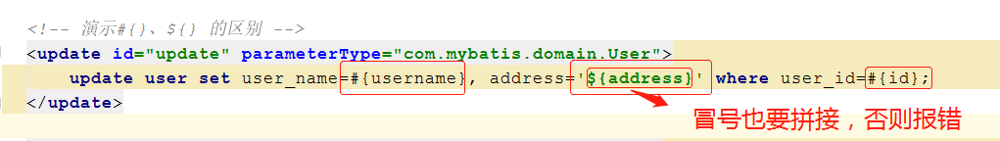
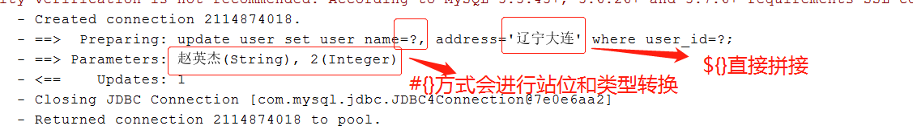

####一.常用api 
	SqlSessionFactory 是一个接口，实现类有DefaultSqlSessionFactory  
	SqlSessionFactoryBuilder().build() 默认返回的就是DefaultSqlSessionFactory实例

	SqlSession 是一个接口，实现类有DefaultSqlSession 
	SqlSessionFactory.openSession()默认返回的就是DefaultSqlSession实例
	  
	SqlSessionFactoryBuilder

	// 获取一个连接，autoCommit表示是否自动提交事务
	SqlSession sqlSession = SqlSessionFactory.openSession(boolean autoCommit)  

	//
	sqlSession.selectList()
	sqlSession.selectOne()
	sqlSession.insert()  
	sqlSession.update()
	


####二.Mybatis 中#{} 和 ${} 的区别 

	#{}:转换类型后拼接，相当于占位符？，可以防注入 
 
	${}:直接拼接，不会转换类型，不能放注入  

使用时：

- 参数是简单类型时：基本数据类型+String  
  如果用#{},里面名称随便写   
  如果用${},必须用value  

- 使用时应当都用#{}，尽量不用${}    


   

  


####三.MyBatis 可以实现类型自动转换   
	
	比如pojo中定义birthday字段为String,数据库中字段对应为datatime类型，  
	只要传值的时候符合日期格式的字符串也可以完成自动类型转换  

	伪代码：	

	User user = new User();  
	user.setBirthday("1991-11-9");
	
	sqlSession.insert("UserMapper",user);  

####四.输入参数类型和输出参数类型  

> **1.输入参数**    

	  简单类型：基本数据类型+String  
		#{}:名称随便  
	    #{}:${value}  
	
	  pojo类型  
		#{} ${} 属性名引用 
	
	  包装对象类型，比如自己定义的QueryVO类型（V:value,O:Object）  
		引用 #{属性.属性名}  
		
	  Map集合
		引用：#{key} 
	
	  多个参数 
		引用时：#{param1},#{param2}.....#{paramN}    


> **2.返回值类型**     

```xml

    <!--resultMap:结果映射：一般属性名和表列名不一致的情况
        id：唯一标示
        type:返回的类型
        -->
    <resultMap id="userList" type="user">
        <!--id:一般写主键的映射：property:属性名 column:列名-->
        <id property="id" column="user_id"/>
        <!--result:映射其他属性和列名-->
        <result property="username" column="user_name"/>
    </resultMap>
    <!--用select/insert/update/delete的resultMap属性配置关联关系，值为resultMap标签中id属性-->
    <select id="selectOne" resultMap="userList" parameterType="int">
        select * from user where user_id = #{id}
    </select>
```     

####五.动态代理模式开发配置   
- 接口UserDao 映射配置文件UserDao.xml  
> 规范：  
> 
- UserDao.xml Mapper配置文件namespace必须是接口的全限类名    
- 配置文件的路径必须与接口的包名路径一致
- 子标签（select,insert,update,delete）id必须是接口中的方法名  
- 参数类型必须与parameterType是一致的  
- 返回值类型必须与resultType是一致的  

核心配置文件
	properties:引入属性文件  
	typeAlias:别名映射 
	mappers:引入配置文件  
		resource="xxx/xxxx/Mapper.xml"  
		class="com.itheima.xxx" 
		package="接口所在的包 比如com.themelove.dao"

1.SqlMapperConfig.xml 配置    

```xml

	<?xml version="1.0" encoding="UTF-8" ?>
	<!DOCTYPE configuration
	        PUBLIC "-//mybatis.org//DTD Config 3.0//EN"
	        "http://mybatis.org/dtd/mybatis-3-config.dtd">
	
	<configuration>
	    <typeAliases>
	        <!--配置包的别名-->
	        <package name="com.mybatis.domain"/>
	    </typeAliases>
	
	    <environments default="development">
	        <environment id="development">
	            <transactionManager type="JDBC"/>
	            <dataSource type="POOLED">
	                <property name="driver" value="com.mysql.jdbc.Driver"/>
	                <property name="url" value="jdbc:mysql://192.168.199.88:3306/mybatis?characterEncoding=utf-8"/>
	                <property name="username" value="themelove"/>
	                <property name="password" value="themelove"/>
	            </dataSource>
	        </environment>
	    </environments>
	
	    <!--配置mapper-->
	    <mappers>
	        <mapper resource="UserMapper.xml"/>
	    </mappers>
	</configuration>
```  

2.UserMapper.xml 配置

```xml 

	<?xml version="1.0" encoding="utf-8" ?>
	<!DOCTYPE mapper
	        PUBLIC "-//mybatis.org//DTD Mapper 3.0//EN"
	        "http://mybatis.org/dtd/mybatis-3-mapper.dtd">
	<!--
	动态代理模式：规范必须遵守
	namespace:必须是代理接口的全限定类名
	select/update/insert/delete 标签的id必须是接口中的方法名
	-->
	<mapper namespace="com.mybatis.domain.UserDao">
	    <select id ="selectAll" resultType="com.mybatis.domain.User">
	        select * from user
	    </select>
	    <!--resultMap:结果映射：一般属性名和表列名不一致的情况
	        id：唯一标示
	        type:返回的类型
	        -->
	    <resultMap id="userList" type="user">
	        <!--id:一般写主键的映射：property:属性名 column:列名-->
	        <id property="id" column="user_id"/>
	        <!--result:映射其他属性和列名-->
	        <result property="username" column="user_name"/>
	    </resultMap>
	    <!--用select/insert/update/delete的resultMap属性配置关联关系，值为resultMap标签中id属性-->
	    <select id="selectOne" resultMap="userList" parameterType="int">
	        select * from user where user_id = #{id}
	    </select>
	</mapper>
```


