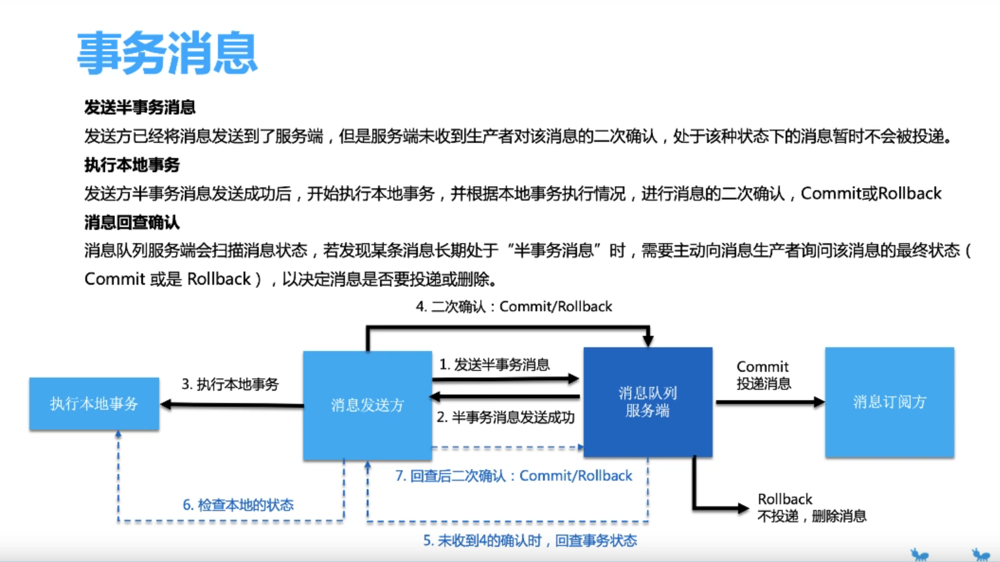

####一.事务理解    

> 1.本地事务  

- 1.单数据源事务   
	
		使用Spring中的@Transactional即可

- 2.多数据源事务   
		
		当本地中使用的是多数据源时，Spring自带@Transactional不能解决；因为多数据源的  
		切换过程中会导致事务失败，所以需要用多数据源事务解决方案 
		
		JTA/XA  atomikos+druid的xaDatasource  

		JTA/XA解决多数据源事务的原理： 
		-1. 需要一个全局事务管理器 
		-2. 实现XA协议的资源，即每个多数据源数据库 
	
> 2.微服务架构下的分布式事务     

- TCC (try commit cancel)    
	- try接口：预留资源（比如冻结库存、预加积分、创建草稿状态出货单） 
	- commit接口：真正确认资源，修改中间try阶段中间状态为确认状态 
	- cancel接口：如果上层出现异常，需要释放try阶段的预留资源    

关于try预留资源一般设计： 
	  
		比如一个扣库存服务，一般有stock(库存)、freeze（冻结字段），比如说现在库存还有10。  
		预留阶段：给freeze字段加1，stock不变，其他服务线程可以使用的库存为stock-freeze=9  
		commit阶段：确认资源，将stock变为stock-1,freeze变为freeze-1  
		cancel阶段：释放预留资源阶段，stocke不变，freeze变为freeze-1

		TCC 的开源框架实现 
	    Atomikos(高级功能收费),tcc-transaction,ByteTcc    
- 可靠消息（RocketMQ）  

B站分布式事务视频：[https://www.bilibili.com/video/av60827231?p=3](https://www.bilibili.com/video/av60827231?p=3)  

####二.2PC  

- 第一阶段（预留资源）：预提交、预先锁定资源（订单库存）、预先校验数据库，缓存中间件是否正常等    
- 第二阶段（确认资源）： 确认第一阶段锁定的资源   

####三.消息中间件事务消息-实现分布式事务 SOFAStack（RocketMQ）消息队列  

	

		

