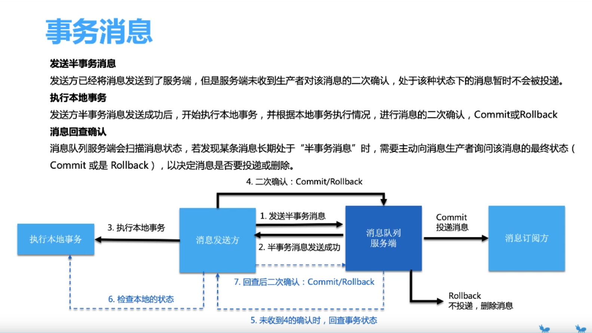

##消息队列
  常用的消息队列中间件有ActiveMQ、RabbitMQ、Kafka、RocketMQ   
  ActiveMQ基本没人用了 
  RabbitMQ是用erlang语言写的 
  RocketMQ是阿里自研和开源的，借鉴了kafka，已经贡献给apeche基金会，成为其顶级项目 
  kafka:基本是行业标杆  

  RocketMQ和kafka：天然分布式架构、都是高可用分布式架构，而且数据多个副本也能做到0丢失、高吞吐量10万级	
####一.JMS（java message service）  

####二.消息队列使用的三个场景也是作用： 
	1.异步 
	2.削锋 
	3.解耦   

####三.消息中间件存在的三个问题

    1.重复消费：  
	
	场景：多个业务都监听了同个消息，别的业务处理失败了，触发了重发机制；  
	这时你又重新接收到了这个消息，而之前该消息的业务已经成功处理了，那么如果没有做容错，就会出现重复消费的情况。  

	幂等：在编程中一个幂等操作的特点是其任意多次执行所产生的影响均与一次执行的影响相同。
    幂等函数：是指可以使用相同参数重复执行，并能获得相同结果的函数。  
	这些函数不会影响系统状态，也不用担心重复执行对系统造成改变。 
    比如：setTrue()函数就是一个幂等函数，重复执行多次结果一样。更复杂的操作幂等保证是利用唯一交易号来实现。

	解决办法：
	

 	2.消息丢失
	3.顺序消费
	  需要顺序消费的场景，一般都是同个业务场景下的不同操作，比如订单的创建、支付、发货、收货等。如果是4个消息的话需要保证顺序发送。
	  提示：比如可以根据一个订单号，这些都是一个订单号，让其发送到同一个列队中，并且之后第一个发送成功之后，再发送下一个，这样就保证了生产者的顺序发送。RocketMQ里MessageQueueSelector队列选择机制可以实现。
 
	4.分布式事物    

####四.SOFAStack是阿里基于RocketMQ的上开发一个消息队列  
	
	创建Topic消息时有四种消息类型可供选择：普通消息、分区顺序消息、事务消息、定时消息  

####五.推送，弹幕系统、动态代理

